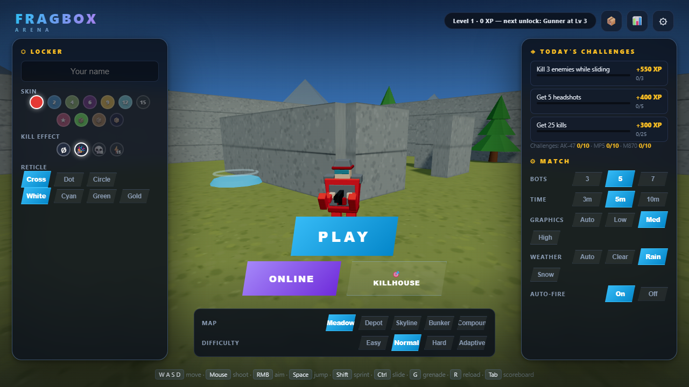
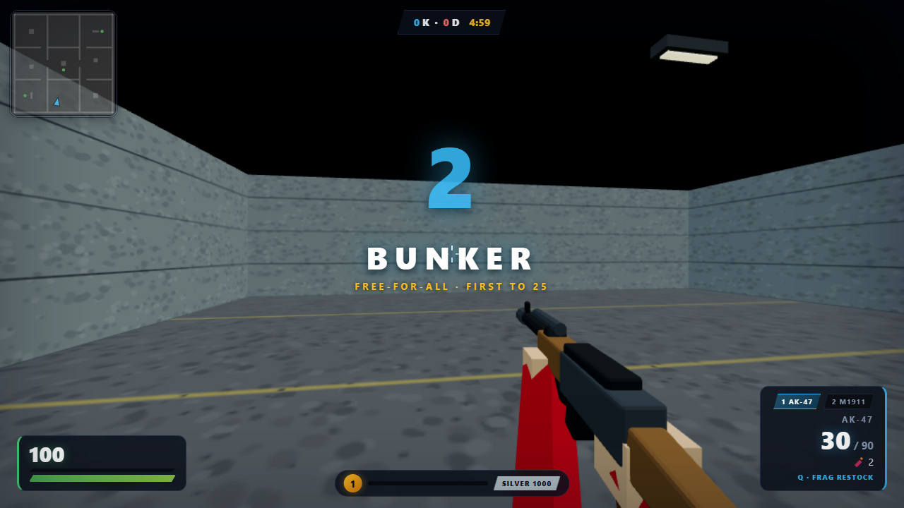

# FragBox

A fast low-poly browser arena FPS. Single `index.html` + vendored Three.js r160,
installable as an offline PWA, with an optional Node WebSocket server for real multiplayer.




## Play

**▶ Play instantly in your browser: https://popnoodler.github.io/fragbox/** (solo vs bots + Killhouse; installable as a PWA, works offline after first load).

**Windows local (incl. multiplayer): double-click `PLAY.bat`.** It starts the local server (multiplayer included) and
opens your browser. Don't open `index.html` directly — browsers block module scripts on
`file://`, so the menu can't work there (the page shows a notice instead of failing silently).

Single-player also works from any static server:

```
npx serve .        # or: python -m http.server
```

Deathmatch against class-playing AI bots (they burst-fire real weapons, lock on gradually,
grab health packs, throw grenades on Hard). Menu picks bot count, difficulty (Easy/Normal/
Hard/Adaptive — Adaptive tracks your K/D), match length, map (Meadow / Depot / Skyline /
Bunker / Compound), weather and graphics tier — all previewed live in the 3D menu behind
your soldier. There's also 🎯 KILLHOUSE — a 60-second aim-trainer with
grades and a replay ghost of your best run. Works on phones (touch stick + buttons + optional
auto-fire assist) and installs as a PWA for offline play.

## Play (multiplayer)

```
node server/server.mjs            # http://localhost:8080  (ws on the same port)
```

Open the URL, click **MULTIPLAYER**. The server is authoritative for combat (validated fire
rate, ray-vs-world occlusion, crouch-aware head/body hitboxes, grenades, hp/kills/respawns)
and keeps lobbies filled with AI bots that yield slots to humans. Modes: FFA, `--mode=tdm`,
`--mode=gungame` (10-weapon ladder), `--mode=ctf` (capture the flag — bots play the
objective), `--mode=dom` (3-point Domination). Rounds end with a top-3 podium ceremony and a
map vote — the server swaps maps live. Kill assists earn XP; idle players are kicked after
90s. The pause menu shows a COPY INVITE link so friends on your network can join.

Server flags: `node server/server.mjs [port] [--pop=N] [--round=SECONDS] [--test]`
(`--test` enables the teleport message used by automated tests — never use in production).

## Controls

| Input | Action |
|---|---|
| WASD / left stick | Move (Shift or full stick = sprint) |
| Ctrl / C | Crouch — sprint+crouch to SLIDE |
| Mouse / right-zone drag | Aim |
| LMB / FIRE button | Shoot |
| RMB | Aim-down-sights — COD-style centered irons on every gun; snipers scope (Shift holds breath) |
| Space / JUMP | Jump (ride the blue pads!) |
| G / 🧨 | Throw grenade (2 per life, ammo packs refill) |
| Q | Class ability (dash, fortify, recon, resupply…) |
| F | Inspect weapon |
| 1–2 / scroll | Switch weapon |
| R | Reload |
| Tab (hold) | Scoreboard |
| Esc | Pause / class change (in MP: Esc again leaves) |

**Feel:** COD-style ADS with per-weapon sight alignment and class zoom tiers, first-blood
slow-motion, killcam freeze-frame with a killer ring, directional death falls, bullet
whiz-bys + wall-impact sparks, bot radio chatter, low-HP heartbeat + desaturation, clutch-time
tension in close finals, per-map ambient beds, magnetic pickups, a map/mode title card on
every deploy — and 📋 SHARE buttons on results to challenge your friends.

**Progression:** account levels unlock 9 classes + skins; per-gun kills unlock challenges,
attachments (25/100) and camos (50/150/400 incl. GOLD); killstreaks earn UAV / Overshield /
Airstrike at 3/5/7; daily challenges + level-ups drop supply crates (roulette cosmetic
pulls, crate-exclusive skins); an ELO rating with Bronze→Diamond bands tracks your career
(📊 page: K/D, accuracy, playtime, rating sparkline).

## Architecture

```
index.html        the whole client: rendering, physics, AI, HUD, audio, net (ES module)
lib/three.module.js   vendored Three.js r160 (offline-capable, no CDN)
shared/map.mjs        5 maps: geometry/spawns/pads/pickups/DOM points — client AND server
shared/weapons.mjs    weapon stats + hitboxes — single source of truth for damage
server/server.mjs     static hosting + WebSocket: snapshots @20Hz, authoritative combat, lobby bots
sw.js                 service worker (network-first navigations; bump CACHE every release)
tools/                verify.mjs (static checks), playtest.js (headless solo), mptest.js (2-client MP)
```

## Hosting / shipping

**Solo (static, PWA):** push this folder to GitHub and enable GitHub Pages — the game plays
offline-installable at `https://<you>.github.io/<repo>/`. The service worker only registers
on github.io/localhost, so other hosts are safe too.

**Multiplayer:** run `node server/server.mjs [port] [--map=depot|skyline|bunker] [--mode=tdm|gungame|ctf|dom] [--pop=N] [--round=S]`
on any Node host (Railway, Fly.io, a VPS) and share the URL. `PLAY.bat` passes flags
through: `PLAY.bat --mode=tdm --map=depot`.

**Game portals (CrazyGames / Poki / itch):** `node tools/build-portal.mjs` produces
`dist/fragbox-portal.zip` — the solo client bundle, iframe-safe. Upload as an HTML5 game.
See `MONETIZATION.md` for wiring their ad SDKs.

## Development

Each release: make a change, run the test suite, bump `CACHE` in `sw.js`, commit.

```
node tools/verify.mjs      # syntax, brace balance, el() id refs, sw version
node tools/playtest.js     # boots the game headless in Edge, simulates play, screenshots
node tools/mptest.js       # spawns server + 2 clients: movement sync, a duel, lobby bots
```

(`npm i` inside `tools/` once for puppeteer-core; inside `server/` for ws.)

See `PROGRESS.md` for the release-by-release changelog and backlog.
